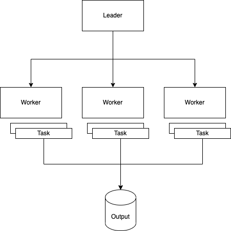
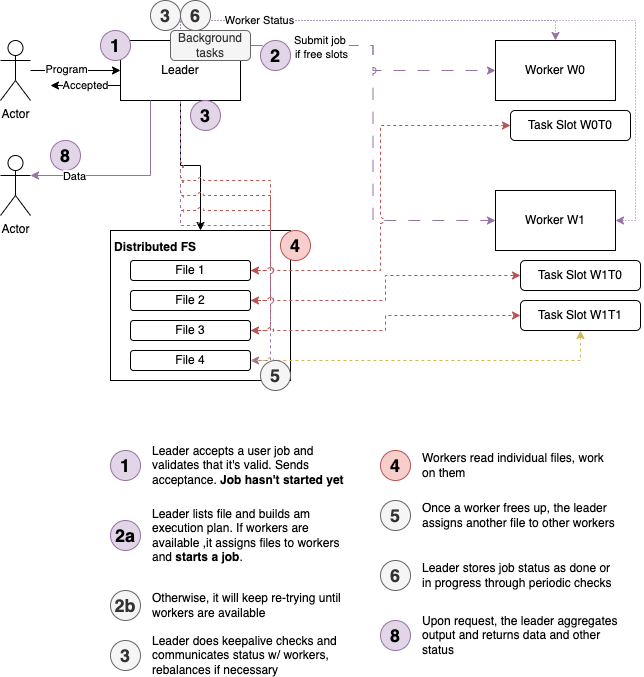
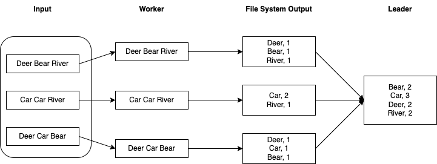
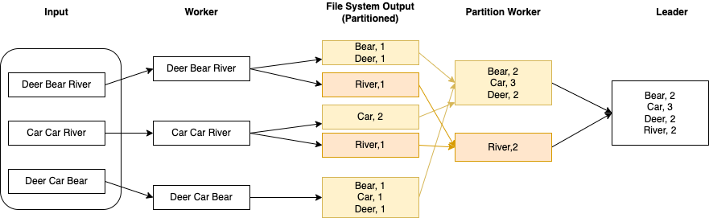

# Bridge Four

Bridge Four is a simple, functional, effectful, single-leader, multi worker, distributed compute system optimized for embarrassingly parallel workloads.

The name is inspired by Brandon Sanderson's "The Stormlight Archive".

It is explained in detail on my [blog](https://chollinger.com/blog/2023/06/building-a-functional-effectful-distributed-system-from-scratch-to-avoid-leetcode-part-1/),where I'm building out this system as a learning exercise instead of "grinding Leetcode".

**It is heavily work in progress, missing key features, and easy to break.**

## Architecture

### Terminology

- A **job** reads files, performs computations, and writes output files
- Each **job** executes *N* **tasks** (N > 0)
- Each **task** executes on a **worker**
- Each **worker** has a set number of **slots** with each can execute exactly 1 **task** in parallel



### Starting a Job

General purpose diagram for "starting a job":



### Comparing it to `WordCount`

(From
the [blog](https://chollinger.com/blog/2023/06/building-a-functional-effectful-distributed-system-from-scratch-to-avoid-leetcode-part-1/))



In other words, instead of the leader assigning lines of input to mappers that emit individual key-value pairs that get moved deterministically (shuffled) and then reduced to an output, our system is more naive:

It reads *pre-split* files (assume e.g. a `Spark` output with properly sized files) which can be read in parallel and write independent outputs, which the leader at the end doing the final aggregation, akin to e.g. a `Spark` `collect()` call that sends data to the `Driver`, with the idea being that each worker's output is a fraction of the original input file. Please see below for a caveat on that in the "Breaking it" section.

That, of course, is not realistic - outside of **embarrassingly parallel problems**, most systems would run into amassive bottleneck at the leader's end. [1]

However, consider a more computationally intense problem, such as [distributed.net](https://en.wikipedia.org/wiki/Distributed.net?useskin=vector) - brute forcing ciphers. 
With minimal adjustments - namely, a mechanism for a worker to report definitive success, which would cause the leader to ignore other worker's output - our system here could feasibly model this, assuming we can pre-generate a set of *seed files*:

For a naive brute force, task *A* tries all combinations starting with the letter "a", task `B` tries all starting with "b" and so on - the input file can be a single letter in a`txt` file. "Naive" is definitely the word of the hourhere.

Lastly, please check the last section for a retrofit of Partitioning into Bridge Four, making this look more similar to classic `Map/Reduce`.



## No Implemented / Missing / Broken

- **Partitioning**: File assignment is greedy and not optimal
- **Worker Stages**: Jobs start and complete, the leader only checks their state, not intermediate *stages* (i.e., we can't build a shuffle stage like `Map/Reduce` right now)
- A sane **job interface** and a way to provide jars - the `BridgeFourJob` trait + an `ADT` is pretty dumb and nothing  but a  stop gap. See the article for details
- **Global leader locks**: The `BackgroundWorker` is concurrency-safe, but you can start two jobs that work on the same data, causing races - the leader job controller uses a simple `Mutex[F]` to compensate
- **Atomic** operations / 2 Phase Commits
- **Consensus**: Leader is a Single Point of Failure
- **Consistency** guarantees: The single-leader natures makes it almost sequentially consistent, but I cannot provide guarantees
- **State machine improvement**: The state machines are simple FSMs, but do not model transitions and actions well and rely to heavily on the `JobDetails` model
- I've been very heavy handed with `Sync[F].blocking`, which often isn't the correct effect
- **File System Abstraction**: This assumes a UNIX-like + something like NFS to be available, which isn't ideal and has it's own locking problems

## Run application

### Docker

```bash
sbt docker:publishLocal
docker-compose up
```

And run `sbin/wordcount_example_docker.sh` to run a sample job.

### Bare Metal

In separate terminals (or computers, provided you have an `NFS` share mounted - see above), run:

```bash 
BRIDGEFOUR_PORT=5553 WORKER_ID=0 sbt worker/run 
BRIDGEFOUR_PORT=5554 WORKER_ID=1 sbt worker/run 
WORKER1_PORT=5554 WORKER2_PORT=5553 sbt leader/run 
```

And run `sbin/wordcount_example.sh` to run a sample job.

## The Sample Job

``sbin/wordcount_*.sh` will showcase a execution with more tasks than workers:

1. Download "War and Peace" by Leo Tolstoy
2. Run a word count job on it, with an artificial delay of 30s per task, with 5 tasks on 4 workers
3. Print the output

Sample output:
```bash 
# ...
{"id":1,"slots":[{"id":{"id":0,"workerId":1},"available":true,"status":{"type":"Done"},"taskId":{"id":1200393588,"jobId":-1368283400}},{"id":{"id":1,"workerId":1},"available":true,"status":{"type":"Done"},"taskId":{"id":1049728891,"jobId":-1368283400}}],"allSlots":[0,1],"availableSlots":[0,1],"runningTasks":[]}
Sleeping for 10 seconds
{"type":"Done"}
Job done
Checking results
{
  "the": 31714,
  "and": 20560,
  "": 16663,
  "to": 16324,
```

## Commits

Please note that this repository is synced from an internal Git server and can't accept contributions at this time.